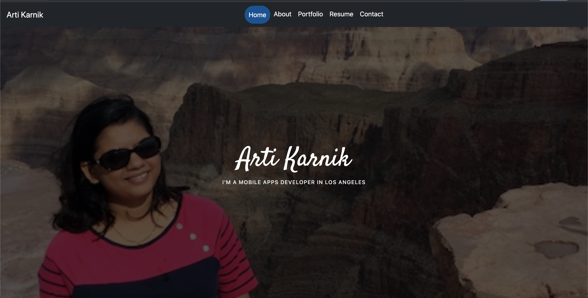
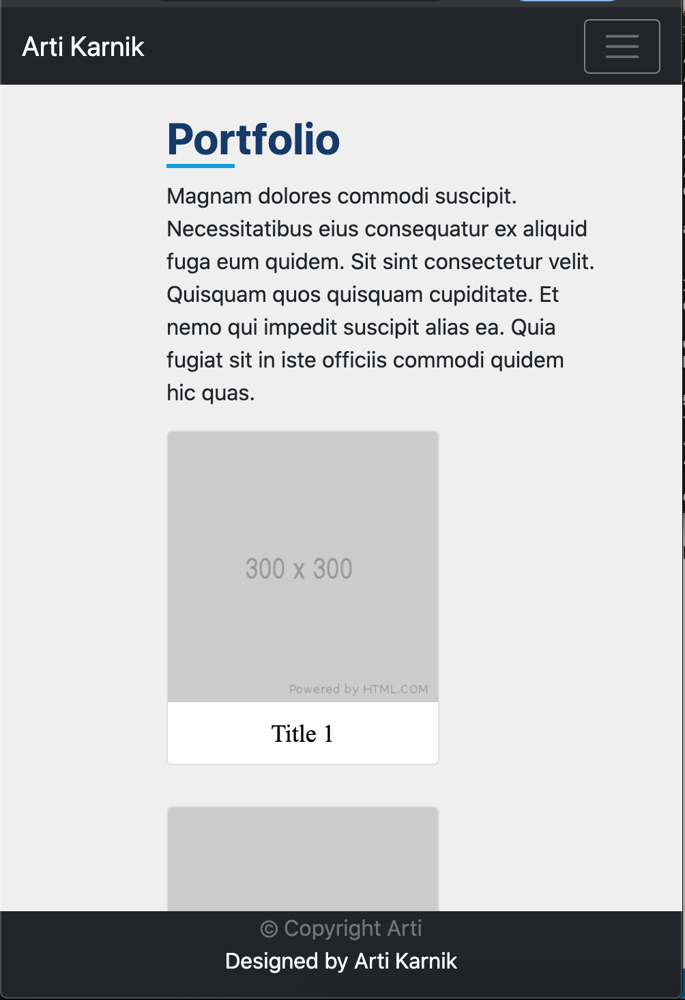
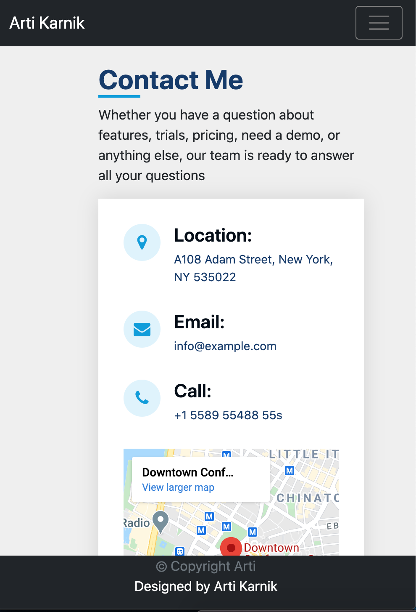
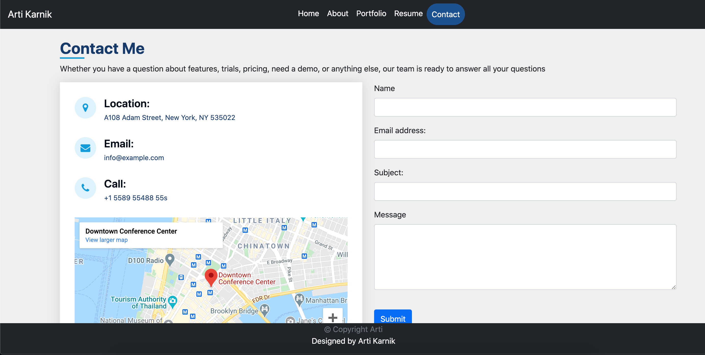

# MyPortfolioPage

<strong> Project Summary: </strong>  
I have had great fun to build on the first assignment & work on this one utilizing advanced HTML, CSS & Bootstrap concepts. Understood & successfully
applied concepts like static header, footers & more importantly a web & mobile responsive page.
I look forward to deep diving into JavaScript, having fun learning what it's all about & more importantly applying the learning to develop & build further more professional looking webpages.

      
       
      
   
      
   
      

<strong> Description: </strong>  
In this exercise, I have developed a multiple page portfolio utilizing HTML, CSS & Bootstrap learnings & concepts. This is web & mobile responsive - 
meaning the page content, menus will resize if browser window size or zoom is changed or operation system zoom is increased or decreased as well as if
a user were to access the web page on a mobile device and it's supported browser.  
This portfolio consists of five different pages. On the home page, these are arranged in a tab like structure on a common header/navigation bar  - 
each having it's own .html page. The header appears on every page & has the same css properties. Below are description for each page :  

1. Home : This has a background image with a one liner description of professional background.  
2. About : Photo added in the left panel along with brief description of my professional qualifications & other details such as email & phone contact, 
address & incorporated social media links. These links have currently not been linked to my actual profile on those respective websites.  
3. Portfolio : This page currently has placeholders of future assignments/work to be showcased.  
4. Resume : This has a summary of skills, professional experience & education.  
5. Contact : This page will allow users on the web to contact me for my services if desired. This is done through a simple form & all of it's fields
are required. Currently validation will show one field at a time if left empty & if 'Submit' is clicked. I have used google api's to embed a small 
map of the location/address.  

Other than above pages, I have incorporated a sticky footer that has basic copyright information with my name in it.  
<strong>Other Features: 
1. Responsive: </strong>  
When the browser window size is reduced to a point where the page becomes responsive or this page were to be accessed on a mobile browser, the menu 
tabs are converted to a drop down menu which is shown with a 3-horizontal line icon in top right corner of the page. Clicking on it opens or closes the 
menu options & available pages can be accessed from here.   

2. Clicking on my name link in top left corner of the page will redirect to the 'Home' (index.html) page.   

<strong>Testing: </strong>  
Unit tested the page on Windows (Chrome, IE11 & Edge) & MAC to ensure that the layout is consistent in full view as well as in the responsive mode.   

<strong> Purpose: </strong>  
Apply learnings from HTML, CSS & Bootstrap to build a multi-page portfolio that is web & mobile responsive.   

<strong> Code Installation: </strong>  
$ cd [path_to_save_codebase]  
$ git clone https://github.com/arti-karnik/MyPortfolioPage  

<strong> Github Profile: </strong>  
https://github.com/arti-karnik

<strong> Application Live URL: </strong>  
https://arti-karnik.github.io/MyPortfolioPage/
